# British Airways Predictive Modeling for Proactive Customer Bookings

# Predictive Modeling of Customer Bookings

# Introduction
In today's era, customer empowerment, fueled by easy access to information, has transformed the traditional buying cycle. Waiting until customers arrive at the airport to secure bookings is no longer a viable strategy; proactivity is the new imperative. This shift is achievable through strategic data utilization and predictive modeling. The core of success lies in the quality of data powering machine learning algorithms, enabling airlines to stay ahead in a landscape where proactive engagement is paramount.

# Objective
* Explore and prepare dataset for predictive modeling.
* Train a machine learning model for customer booking predictions using a suitable algorithm.
* Evaluate model performance through cross-validation and generate key metrics.
* Create visualizations to interpret variable contributions.

# Tools Used
* Jupyter Notebook (Python)
* Matplotlib
* Seaborn
* Pandas
* Numpy
* pycountry_convert
* scipy.stats
* sklearn.model_selection
* sklearn.ensemble
* sklearn.metrics

# Data Description
- num_passengers = number of passengers travelling
- sales_channel = sales channel booking was made on
- trip_type = trip Type (Round Trip, One Way, Circle Trip)
- purchase_lead = number of days between travel date and booking date
- length_of_stay = number of days spent at destination
- flight_hour = hour of flight departure
- flight_day = day of week of flight departure
-route = origin -> destination flight route
- booking_origin = country from where booking was made
- wants_extra_baggage = if the customer wanted extra baggage in the booking
- wants_preferred_seat = if the customer wanted a preferred seat in the booking
- wants_in_flight_meals = if the customer wanted in-flight meals in the booking
- flight_duration = total duration of flight (in hours)
- booking_complete = flag indicating if the customer completed the booking

## Snapshot of Data Information
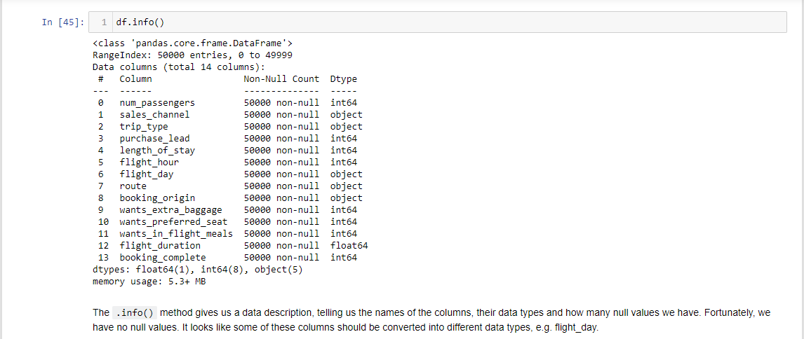

The dataset comprises of 50,000 entries, with no missing values. It encompasses 14 features, primarily composed of integer and float data types. Specifically, five out of the 14 features are of string data type.

# Data Conversion, Continent Grouping, and Outlier Detection
The categorical columns 'flight_day,' 'sales_channel,' and 'trip_type' underwent encoding, resulting in the creation of new columns with numerical values. Simultaneously, the 'booking_origin' column, with a unique count of 104, was transformed by grouping countries into continents using py_country_converter. Six new columns, one for each continent, were generated and converted into numerical data for analytical and machine learning optimization. Additionally, outlier detection via boxplot analysis identified 'num_of_passengers,' 'purchase_lead,' and 'length_of_stay' as columns with noticeable outliers, necessitating further investigation.

# Exploratory Data Analysis(EDA)

## Outlier Detection with Scatterplots and Z-Score
In the pursuit of identifying potential outliers, a dual approach employing scatterplots and z-score analysis was employed. The scatterplots provided a visual representation of data points, aiding in the identification of patterns and outliers, while the z-score calculation quantified the degree of deviation from the mean, offering a statistical measure to flag potential outliers. Together, these techniques enhance the robustness of outlier detection within the dataset.
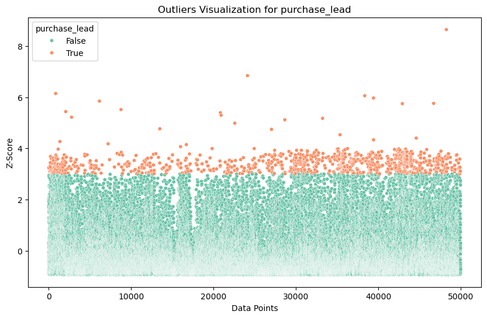

Upon examining the plot, it is evident that the purchase_lead, representing the duration between booking and travel dates, challenges the straightforward interpretation of outliers. The apparent outliers may not be anomalous, as the nature of this variable involves the temporal span leading to potential variations.

From the plot, a notable concentration of data points falls within a z-score range of 0 to 3, indicating a relatively normal distribution. However, the outliers, characterized by exceptionally high z-scores, signify deviations from this prevalent pattern.

**Extreme Early Bookings:**
- The majority of data points clustering between z-scores of 0 and 3 likely signify bookings made significantly earlier than the conventional booking window.

**Last-Minute Bookings:**
- Outliers with very high z-scores may indicate bookings made very close to the travel date, suggesting last-minute arrangements.

## Days Between Traveling Date and Booking Date Across Continents
The analysis aimed to investigate booking behavior within different continents, specifically focusing on understanding how the distribution of days between booking and traveling varies across these geographical regions.
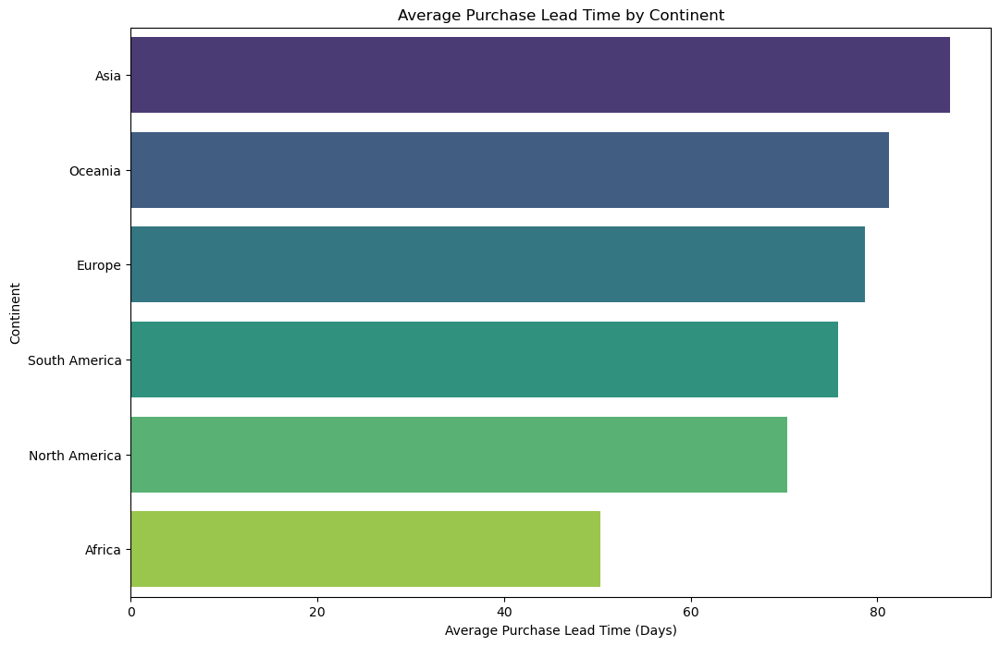

Upon examination of the bar plot, it is evident that the continent with the highest average number of days between traveling date and booking date is **Asia** closely followed by **Oceania** and **Europe**. **South-America**, and **North_America** also exhibits a notable duration, while **Africa** records the least duration on the chart.
*This analysis provides insights into the distribution of days between traveling date and booking date across various continents.*

## Identifying Countries with Extended Booking Windows: Top 20 Rankings
This analysis involves determining the top 20 countries based on their average purchase lead time. This analysis is conducted to understand and highlight countries where travelers tend to plan and book their trips well in advance. The resulting information can provide insights into regional travel habits, economic factors, and cultural influences that impact the duration between booking and travel.

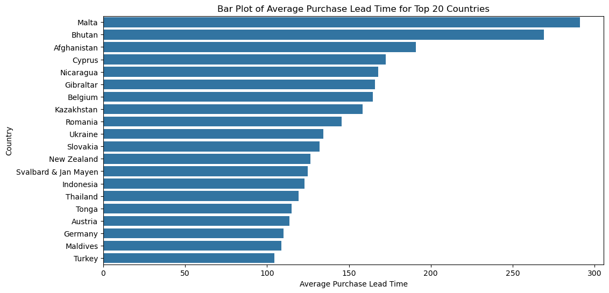
In line with the exploration into countries where travelers tend to plan and book well in advance, Malta emerges as the front-runner among the top 20. Bhutan and Afghanistan closely follow, reflecting a trend of extended planning. Interestingly, Turkey stands out with the shortest average purchase lead time in this group, underscoring diverse booking behaviors across these countries. This variation offers valuable insights into the range of regional travel habits and planning preferences.

## Exploration of Data Distribution: Entries Across Continents
This exploration is conducted to gain insights into the distribution of data entries across continents. The resulting information can offer valuable perspectives on regional representation within our dataset, potentially revealing patterns or concentrations that reflect distinct characteristics of each continent.
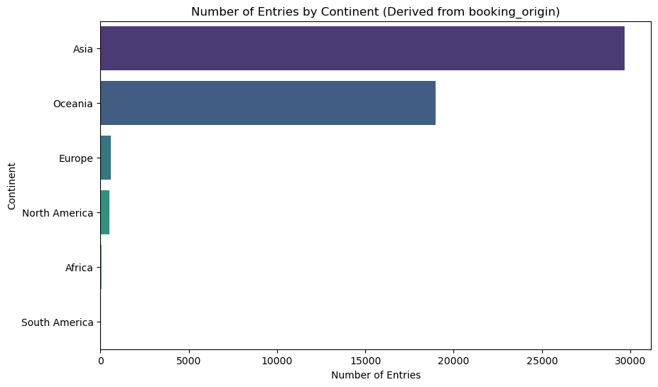

**Noteworthy Business Insights:**

**Regional Dominance:**
- Asia takes the lead as the primary market for flight bookings, with an impressive count surpassing 3000 entries. Oceania closely follows, boasting approximately 2000 entries, suggesting substantial demand in these regions.

**Limited Engagement in Established Markets:**
- Europe and North America, despite being established markets, exhibit relatively lower participation, as reflected in the minimal number of entries.

**Untapped Potential in Emerging Markets:**
- Africa and South America currently show underrepresentation, unveiling untapped potential and providing opportunities for market growth and expansion in these emerging regions.

## Exploring Variable Relationships via Correlation Matrix
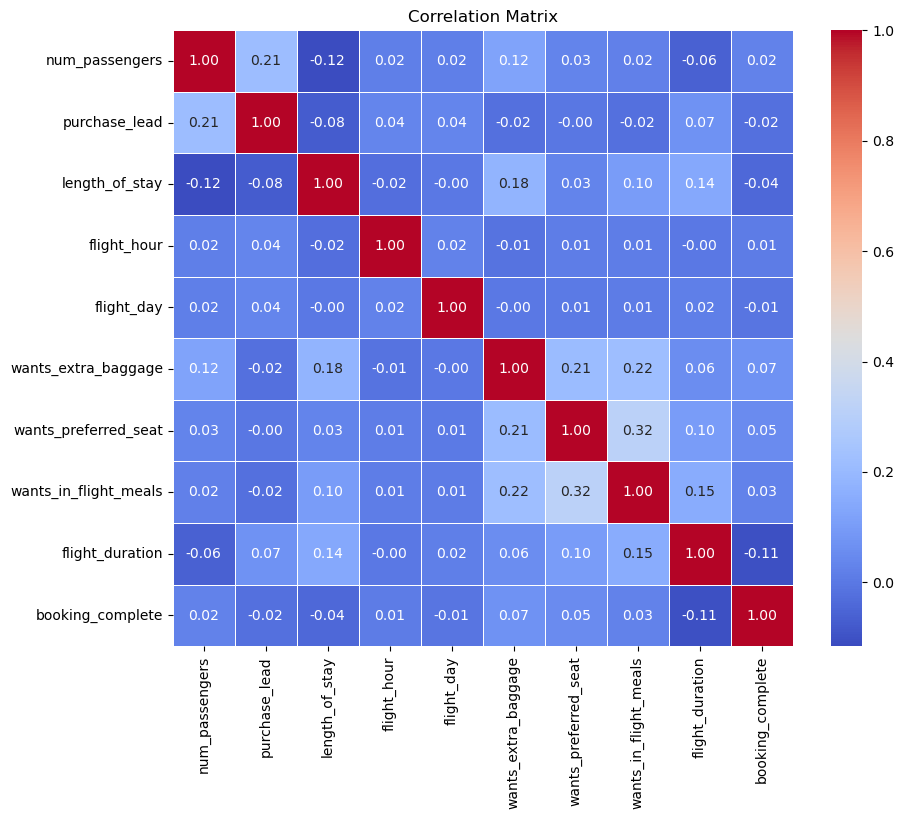

**Correlation Analysis**
**Positive Correlations:**
- num_passengers has a positive correlation with purchase_lead (0.21) and wants_extra_baggage (0.12).
- length_of_stay is positively correlated with wants_extra_baggage (0.18) and wants_in_flight_meals (0.10).
- flight_day and flight_hour have a positive correlation of 0.02.

**Negative Correlations:**
- length_of_stay has a negative correlation with num_passengers (-0.12).
- purchase_lead is negatively correlated with length_of_stay (-0.08).
- flight_duration is negatively correlated with num_passengers (-0.06) and booking_complete (-0.11).

**Weak Correlations:**
- Many variables show weak correlations (close to zero) with each other.

# Data Preparation
**Train-Test Split of the Dataset:** 80% Training and 20% Testing

# Modeling
Random Forest was selected because it not only effectively predicts customer bookings but also provides invaluable insights into variable contributions, offering a comprehensive and interpretable solution that aligns seamlessly with the dataset exploration, model training, evaluation, and visualization needs.

# Model Prediction and Evaluation
## Classification Report
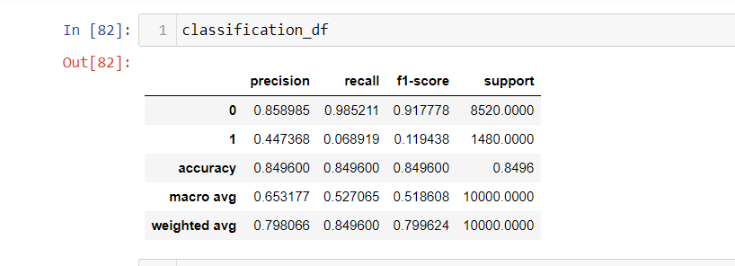

- The classification results reveal a robust performance for the Negative Class (Class 0), showcasing a Precision of 85.90%, Recall approximately 98.52%, and an impressive F1-Score of 91.78%. This indicates the model's proficiency in correctly identifying instances of the Negative Class.

- In contrast, the Positive Class (Class 1) exhibits lower performance metrics, with a Precision of 44.74%, Recall of 6.89%, and an F1-Score of 11.94%. These metrics suggest a relative weakness in the model's ability to accurately predict instances of the Positive Class, especially when compared to the robust performance on the Negative Class. This observation raises concerns about potential class imbalance or overfitting.

- To address these concerns and evaluate the model's generalization capability, a cross-validation analysis is recommended. Cross-validation will provide insights into how the model performs on unseen data, helping to identify areas for improvement and enhance overall predictive accuracy.

## Classification Metrics by Class
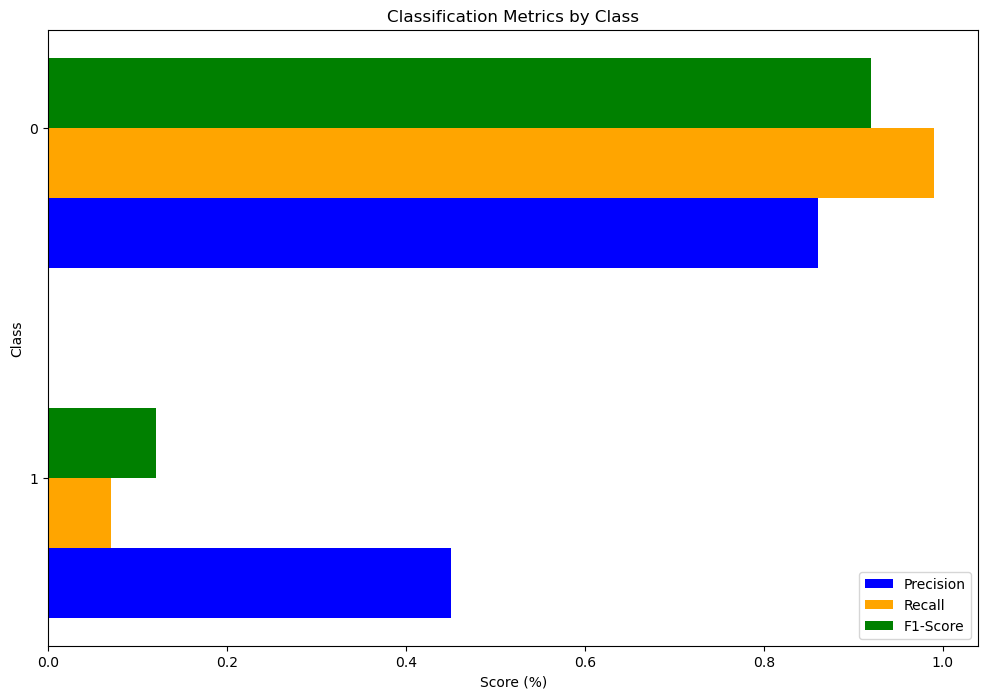
*The plot visually represents the performance metrics for both Class 0 and Class 1, as discussed earlier.* *It serves as a graphical illustration of the precision, recall, and F1-score for each class, providing a comprehensive view of the model's performance across both classes.*

## Confusion Matrix
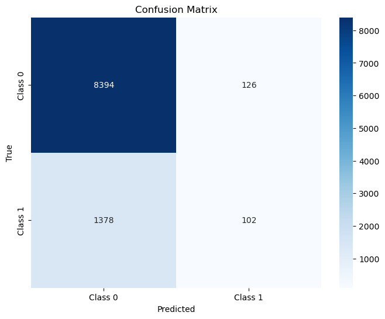

**Consufion Matrix**

**True Positive (TP):**
- 99 instances were correctly predicted as class 1.

**True Negative (TN):**
- 8394 instances were correctly predicted as class 0.

**False Positive (FP):**
- 126 instances were incorrectly predicted as class 1.

**False Negative (FN):**
- 1381 instances were incorrectly predicted as class 0.

# Cross Validation 
## Snapsot of Cross Validation Results 
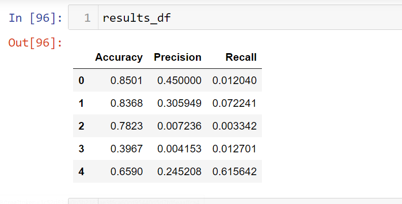
*The displayed dataframe illustrates the cross-validation results employing 5 folds.* *It offers a comprehensive view of the model's performance across these folds, showcasing different levels of accuracy, precision, and recall for each class.*

## Mean Average Results
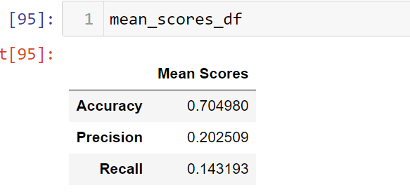

The mean average classification report, with an accuracy of approximately 70.5%, a precision of about 20.3%, and a recall of around 14.3%, suggests that the model's performance on unseen data may be suboptimal. The relatively low precision and recall values indicate challenges in correctly identifying and classifying instances, which could be attributed to factors such as class imbalance or overfitting. Further investigation and fine-tuning may be necessary to enhance the model's generalization capabilities and improve its effectiveness on new, unseen data.

# Feature Importances from RandomForest Model
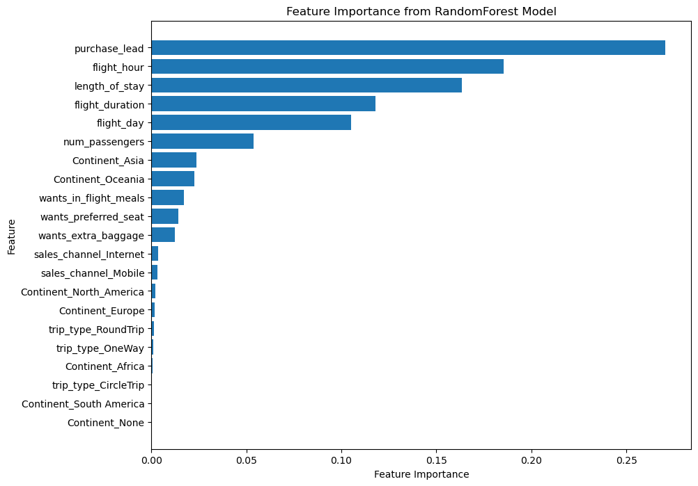

- The feature importance plot underscores that the variable "purchase_lead," signifying the duration between the purchase and departure dates, stands out as the most crucial factor influencing the model's predictive capability. Additionally, flight-related details, such as flight time and duration, prove to be significant contributors to the model's performance. In contrast, the extracted continent information from the booking origin, categorized as 'Continent_Europe,' 'Continent_South America,' 'Continent_Africa,' and 'Continent_None,' demonstrates a minor role and exerts limited influence on the model's outcome. This implies that these continent-related features have little importance in shaping the model's performance.

# Conclusion
In conclusion, the steps involved in preparing and understanding the data, including preprocessing, conversion, feature engineering, and exploration, were crucial in unraveling complexities within specific features that showed potential outliers. This in-depth comprehension became the bedrock for developing a predictive model.

The choice of the Random Forest model was deliberate, leveraging its unique strengths in providing interpretability and highlighting feature importance. Its adaptability to scenarios requiring a clear understanding of individual variables' impact on predictions, capacity to handle various data types, and resilience to overfitting made it a robust selection for diverse datasets. In cross-validation, it demonstrated a mean average accuracy of 70.5%, a precision of 0.203, and a recall of about 0.143, offering quantitative insights into the model's performance.

Furthermore, a detailed analysis of feature importance not only pinpointed crucial features for prediction but also uncovered areas necessitating deeper investigation. The gained insights are pivotal for making informed decisions about which features require closer scrutiny and which ones might benefit from exclusion. This strategic approach aims to enhance the model's performance on both observed and unseen data, ensuring a strong and generalized predictive capability.

To sum up, the comprehensive strategy of thorough data exploration, model evaluation metrics, and feature importance analysis guides ongoing refinement, fostering continual improvement in the predictive model's accuracy and effectiveness.

# Recommendation

**Feature Refinement:**
- Delve deeper into refining features by closely examining those identified as crucial for accurate predictions.
- Investigate and potentially eliminate features that exhibit limited importance, contributing minimally to the model's overall effectiveness.

**Model Fine-Tuning:**
- Explore the possibility of fine-tuning the Random Forest model parameters to unlock potential improvements in predictive performance.
- Assess alternative algorithms to identify whether any offer superior performance tailored to this specific application.

**Addressing Class Imbalance:**
- In light of the noticeable performance gap between the two classes, explore strategies to rectify potential class imbalance.
- Experiment with techniques such as oversampling, undersampling, or adjusting class weights during model training to achieve a more balanced representation.

**Continuous Monitoring:**
- Establish a robust system for ongoing monitoring and evaluation of the model's performance over time.
- Regularly update the model based on emerging data patterns and evolving customer booking behavior to maintain relevance and accuracy.

**Enhanced Data Collection:**
- Consider expanding the dataset by incorporating additional relevant features that have the potential to contribute to enhanced predictions.
- Assess the impact of integrating new data on the model's accuracy and its ability to generalize effectively to varying scenarios.
